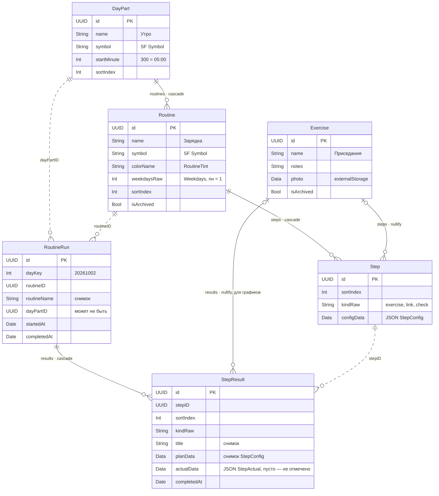

# Архитектура

Продуктовые термины — в [PRODUCT.md](PRODUCT.md).

## Главное решение: расширяемость на уровне шага

Пользователь собирает рутины сам, поэтому «вид рутины» — это данные, а не класс в коде. Точка расширения — **вид шага** (`StepKind`). Рутина — упорядоченный набор шагов любых видов.

```
DayPart «Утро» (с 05:00)
├── Routine «Зарядка» (пн–пт)
│   ├── Step exercise → Exercise «Приседания», 3 × 15
│   └── Step exercise → Exercise «Планка», 3 × 30 с, отдых 20 с
├── Routine «Дневник» (каждый день)
│   └── Step link → Journal, «Запись в дневник»
└── Routine «Duolingo» (каждый день)
    └── Step link → duolingo://, «Урок»
```

Зал (milestone 3) — это новый вид шага «силовое упражнение» с весом. `DayPart`, `Routine` и уже сохранённая история при этом не меняются.

## Шаблон и выполнение

Два независимых графа:

- **Шаблон**: `DayPart → Routine → Step (→ Exercise)` — что запланировано. Свободно редактируется.
- **История**: `RoutineRun → StepResult` — что сделано в конкретный день. Хранит **снимок плана** на момент выполнения и фактический результат.

Правка или удаление шаблона историю не меняет: вчерашние 3 × 15 остаются 3 × 15, даже если сегодня план стал 3 × 20.

## Хранилище: SwiftData

**Почему SwiftData:** без сторонних зависимостей, нативная связка со SwiftUI (`@Query`), версионирование схемы и миграции из коробки. Объёма данных одного человека (сотни записей в год) хватит с большим запасом.

**Разнородные настройки шагов** хранятся так: поле-дискриминатор `kind` + Codable-структура настроек, закодированная в `Data`. Новый вид шага — новая Codable-структура, миграция схемы не нужна. То, по чему нужно искать и группировать (упражнение для графиков, день для серии), вынесено в настоящие поля и связи.

Рассмотренные альтернативы:

- **Наследование моделей SwiftData** (появилось в iOS 26). Каждый новый вид шага — подкласс и миграция схемы. Сама Apple советует использовать наследование только при явной выгоде.
- **GRDB (SQLite)**. Больше контроля и SQL для графиков, но это сторонняя зависимость и больше кода.

Вся работа с хранилищем идёт через протокол `RoutineStore`, поэтому сменить хранилище позже — локальное изменение.

## Схема v1

Сплошные линии — связи SwiftData, пунктирные — ссылки по `UUID` без связи: история не зависит от шаблона и переживает его удаление. Диаграмму обновляем в том же PR, что и модели.



```swift
// Шаблон

@Model final class DayPart {
    var id: UUID
    var name: String               // «Утро»
    var symbol: String             // SF Symbol
    var startMinute: Int           // 300 = 05:00; определяет текущую часть дня
    var sortIndex: Int
    @Relationship(deleteRule: .cascade, inverse: \Routine.dayPart)
    var routines: [Routine]
}

@Model final class Routine {
    var id: UUID
    var name: String
    var symbol: String
    var colorName: String
    var weekdaysRaw: Int           // Weekdays: OptionSet, пн = 1 << 0 … вс = 1 << 6
    var sortIndex: Int
    var isArchived: Bool
    var dayPart: DayPart?
    @Relationship(deleteRule: .cascade, inverse: \Step.routine)
    var steps: [Step]
}

@Model final class Step {
    var id: UUID
    var sortIndex: Int
    var kindRaw: String            // "exercise" | "link" | "check"
    var configData: Data           // JSON-кодированный StepConfig
    var exercise: Exercise?        // вынесено из config: для графиков и поиска
    var routine: Routine?
}

@Model final class Exercise {
    var id: UUID
    var name: String
    var notes: String
    @Attribute(.externalStorage) var photo: Data?   // уменьшенное до ~1600 px
    var isArchived: Bool
    // Обратная связь обязательна: без неё удаление упражнения оставляет у шага ссылку на удалённый объект
    @Relationship(deleteRule: .nullify, inverse: \Step.exercise)
    var steps: [Step]
    @Relationship(deleteRule: .nullify, inverse: \StepResult.exercise)
    var results: [StepResult]
}

// История — Core/Model/SchemaV1+History.swift.
// RoutineRun.start(routine, at:, calendar:) создаёт выполнение: по результату на шаг, в порядке шагов,
// с копией планов. Факт пишется через StepResult.record(_:at:) или recordAsPlanned(at:).

@Model final class RoutineRun {
    var id: UUID
    var dayKey: Int                // 20261002 — день в календаре пользователя
    var routineID: UUID            // ссылка на шаблон; шаблон может быть уже удалён
    var routineName: String        // снимок
    var dayPartID: UUID?           // рутина могла быть без части дня
    var startedAt: Date
    var completedAt: Date?
    @Relationship(deleteRule: .cascade, inverse: \StepResult.run)
    var results: [StepResult]
}

@Model final class StepResult {
    var id: UUID
    var stepID: UUID
    var sortIndex: Int
    var kindRaw: String
    var title: String              // снимок: название упражнения или шага
    var planData: Data             // снимок StepConfig на момент выполнения
    var actualData: Data?          // JSON StepActual: {"type":"exercise","value":[{"reps":15}]}; nil — ещё не отмечено
    var exercise: Exercise?        // для графиков по упражнению
    var completedAt: Date?
    var run: RoutineRun?
}
```

## Виды шагов в коде

Набор видов фиксирован в коде, поэтому это `enum` с полезной нагрузкой. Поведение каждого вида описано протоколом `StepKind`.

```swift
enum StepConfig: Codable, Hashable {
    case exercise(ExerciseStep)
    case link(LinkStep)
    case check(CheckStep)
}

protocol StepKind: Codable, Hashable {
    associatedtype Result: Codable, Hashable
    static var kind: String { get }                 // значение Step.kindRaw
    func resultAsPlanned() -> Result                // «сделано по плану» одним тапом
    func isComplete(_ result: Result) -> Bool
}

struct ExerciseStep: StepKind {
    enum Target: Codable, Hashable {
        case reps(Int)
        case duration(seconds: Int)
    }
    var sets: Int
    var target: Target
    var restSeconds: Int?
    typealias Result = [Target]     // факт по каждому подходу в тех же единицах; меньше повторов — всё равно сделано
}

struct LinkStep: StepKind {
    var title: String
    var url: URL                                    // duolingo://, Journal и т.п.
    typealias Result = Bool
}

struct CheckStep: StepKind {
    var title: String
    typealias Result = Bool
}
```

Новый вид шага добавляется так: структура, реализующая `StepKind`, плюс новый `case` в `StepConfig`. Компилятор сам укажет все `switch`, где нужно описать его UI: ячейку чеклиста и редактор.

## Правила

- **День — это `dayKey: Int`** (григорианский yyyyMMdd в часовом поясе пользователя, `DayKey.of`), а не `Date`. Серии не ломаются из-за смены часового пояса и перехода на летнее время. Григорианский всегда, даже если у пользователя выбран другой календарь: иначе ключи «прыгнули» бы на сотни лет при его смене.
- **У каждой модели `id: UUID`** — стабильные ссылки из истории, виджета и диплинков.
- **Бизнес-логика — чистые функции над value-типами**: расписание, серия, завершённость. Тестируется без SwiftData.
- **Схема версионируется с первого дня**: `VersionedSchema` + `SchemaMigrationPlan`. Модели вложены в `SchemaV1` (`Core/Model/SchemaV1.swift`), остальной код видит их через `typealias DayPart = SchemaV1.DayPart` и т. д. До первого релиза v1 ещё дополняется (история — в 1.2); после релиза она заморожена, изменения идут в `SchemaV2` и этап `AppMigrationPlan`.
- **Настройки шага читаются через `Step.config`, пишутся через `Step.setConfig(_:)`** — так `kindRaw` не расходится с `configData`. Value-типы шагов и `Weekdays` — `nonisolated`, их можно кодировать вне главного потока.
- **Простая или составная рутина:** если в рутине ровно один шаг-ссылка или отметка, она выполняется прямо в списке «Сегодня». Иначе открывается отдельный экран.

## Модули

Решено в 0.1, введено в 0.2. Всё приложение — один app-таргет, кроме дизайн-системы.

- **`DesignSystem` — отдельный framework-таргет**: токены, компоненты, каталог отклика. Фичи делают `import DesignSystem` и видят только `public` API, поэтому правило «UI только через дизайн-систему» держит компилятор, а не только линтер и ревью. Исходники — в `DesignSystem/` в корне репозитория (внутри `ExercisesTracker/` их подхватил бы и app-таргет), тесты — в `DesignSystemTests/`. Настройки Swift такие же, как у приложения: Swift 6, `MainActor` по умолчанию. Исключение — токены: типы токенов объявлены `nonisolated`, потому что цвета разрешаются и вне главного потока (виджет, Live Activity, `ImageRenderer`). Цвет — собственный `ShapeStyle` (`ColorToken`), который выбирает значение из окружения SwiftUI, без замыкания динамического `UIColor`: такое замыкание, унаследовав `MainActor`, вне главного потока падает на проверке исполнителя. Папки модуля добавляются в `project.yml` и в `included` у `.swiftlint.yml`.
- **Галерея дизайн-системы — в приложении, за `#if DEBUG`**, без отдельного app-таргета: компоненты удобнее смотреть в настоящем приложении и на телефоне. В Release не попадает.
- `Model`, `Persistence`, `Scheduling` пока остаются в app-таргете. Выносить их в модуль имеет смысл, когда появится второй потребитель — виджет (F7) или Live Activity (F9).

## Структура папок

```
ExercisesTracker/
  App/                точка входа, корневая навигация
  Core/
    Model/            SwiftData-модели, StepConfig, StepKind
    Persistence/      ModelContainer, версии схемы, RoutineStore, демо-данные
    Scheduling/       что сегодня, текущая часть дня
    Streaks/          расчёт серии (milestone 2)
  Features/
    Today/
    RoutineRun/
    Editor/
    Library/
  Debug/
    Gallery/          галерея дизайн-системы, только Debug
DesignSystem/         framework-таргет: токены, компоненты, хаптики и анимации — см. DESIGN.md
  Tokens/
  Components/
  Feedback/
DesignSystemTests/
```
